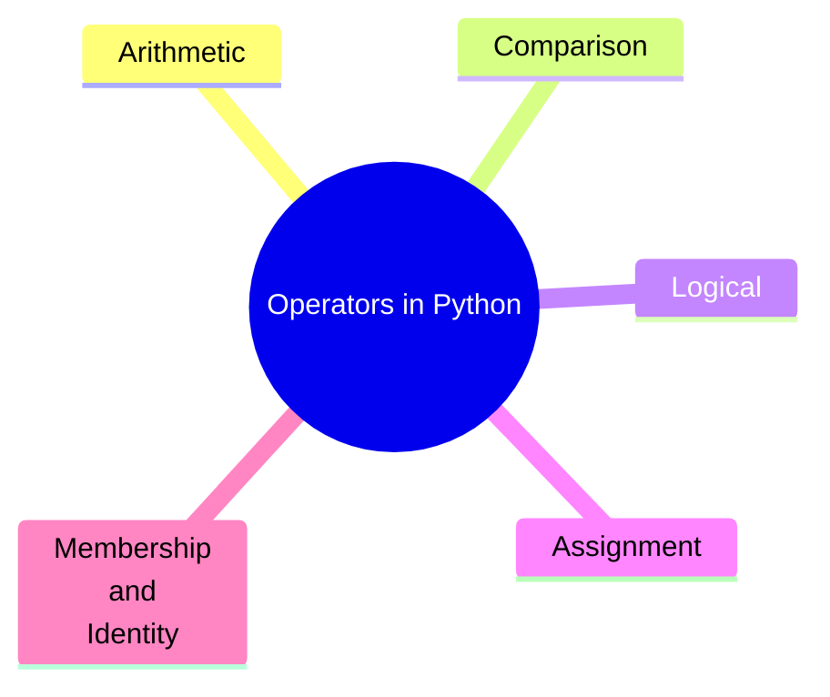

# Day 02: Data types and operators.
## Today's objetive
Understand and practice Python’s fundamental data types and operators. Learn how different types behave, how to use them effectively, and how to perform basic operations and comparisons to build a foundation for programming logic.

## Python Data Types (Built-in)
**Python is dynamically typed, meaning you don’t have to declare the type of a variable.** In the following table you can find the most common data types:

| Type    | Example         | Description                   |
| ------- | --------------- | ----------------------------- |
| `int`   | `42`            | Integer numbers               |
| `float` | `3.14`          | Decimal numbers               |
| `str`   | `"hello"`       | Text (strings)                |
| `bool`  | `True`, `False` | Boolean values                |
| `list`  | `[1, 2, 3]`     | Ordered, mutable collection   |
| `tuple` | `(1, 2, 3)`     | Ordered, immutable collection |
| `dict`  | `{"a": 1}`      | Key-value pairs               |
| `set`   | `{1, 2, 3}`     | Unordered, unique items       |

We can remmind how to know the dat type of a variable (Day 1 notes)

```python
variable = 10
type(variable)
```

## Operators in Python



### Aritmetic Operators 
```python
+  # Addition
-  # Subtraction
*  # Multiplication
/  # Division
// # Floor division
%  # Modulo
** # Exponentiation
```
### Comparison Operators 
```python
==  # Equal to
!=  # Not equal to
>   # Greater than
<   # Less than
>=  # Greater than or equal to
<=  # Less than or equal to
```
### Logical Operators 
```python 
and
or
not
```
### Assignment Operators 
```python 
x = 5
x += 3  # Same as x = x + 3
x *= 2  # Same as x = x * 2
```
### Membership and Identity Operators
```python 
in          # Checks membership
is          # Checks identity (same object in memory)
```
## Small note 
> **Many bugs come from not understanding the types you're working with.** Use type() and isinstance() often to debug or explore 🌱