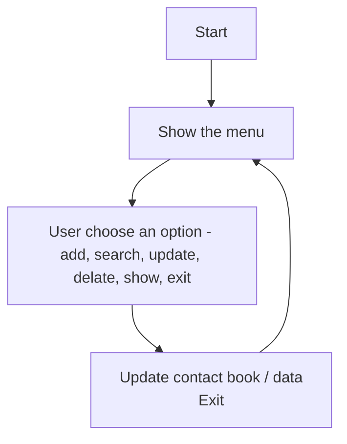

# Day 14. Mini project #1.
## Today's objective
Apply the knowledge acquired over the last few days in a practical project: **Contact book**.
## Understanding the problem 
- **What should the program do?:** I need to create a simple contact book.
- **Who is going to use it?:** Another programmer 
- **What actions should the program/code perform?:**
    - Show
    - Add
    - update 
    - delate 
    - search 
## Useful mental tools/questions. 
- **What data do I need?:** Dictionary with contact information. 
- **What actions/functions are required?:** Show, add, update, delate, delate, search. 
- **Do I need to repeat anything?:** Yes, the menu for asking options. 
- **Do i need to decide anything?:** Yes, the option I want to choose (add, search, delete, etc)
- **Does the date need to persist?:** Yes, i will save it in a `.txt` file. 

## Workflow 
